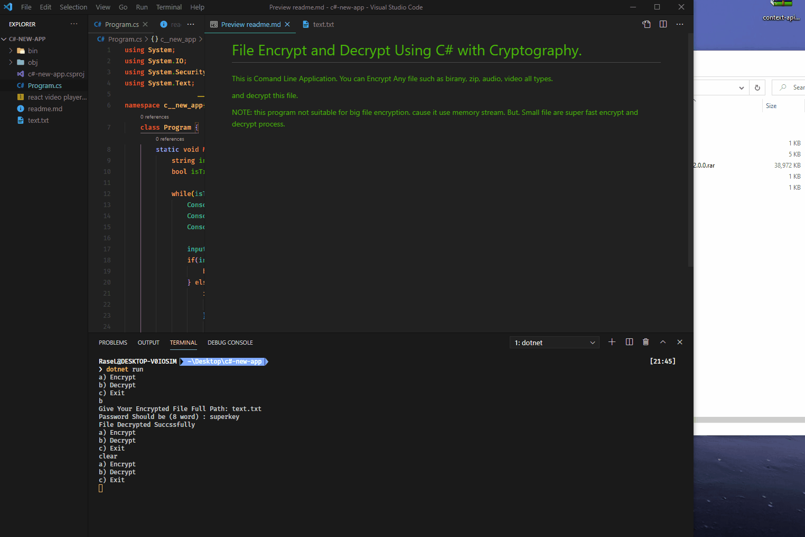

# File Encrypt and Decrypt Using C# with Cryptography.

This is Comand Line Application. You can Encrypt Any file such as birany, zip, audio, video all types. and decrypt this file.

NOTE: this program not suitable for big file encryption. 
cause it use memory stream. 
But. Small file are super fast encrypt and decrypt process.

## You Can Download and Run it you desktop...
https://github.com/rasel-code-dev/C-Cryptography-File-Encrypt/bin/debug/netcoreapp3.1/c#-new-app.exe

NOTE: To run this exe it need netcoreapp3.1 folder in repo

### Application Preview

<!-- [preview]("./Program.cs") -->